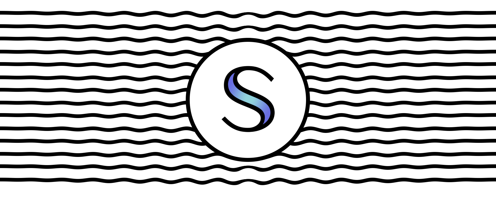

<!-- Hero -->
<columns mode="slim">
<block>

</block>
</columns>

<columns mode="slim">

## What is Secret Network? 🛹

Want to build a better internet? Solve for privacy.

Secret Network is a blockchain-based, open-source protocol that lets anyone perform computations on encrypted data, bringing privacy to smart contracts and public blockchains. Our mission: improve the adoption and usability of decentralized technologies, for the benefit of all.

Mainnet is out! Get the latest release at https://github.com/enigmampc/SecretNetwork/releases/latest.

### Community

</columns>

<columns number="5" number-s="2" mode="slim">
<block>

[<button>Homepage</button>](https://scrt.network)

</block>
<block>

[<button>Blog</button>](https://blog.scrt.network)

</block>
<block>

[<button>Forum</button>](https://forum.scrt.network)

</block>
<block>

[<button>Wiki</button>](https://learn.scrt.network)

</block>
<block>

[<button>Discord</button>](https://discord.com/invite/SJK32GY)

</block>

</columns>

<columns weight="right" mode="slim" number="4">
<block>

[<button>Twitter</button>](https://twitter.com/SecretNetwork)

</block>

<block>

[<button>Community Telegram Channel</button>](https://t.me/SCRTnetwork)

</block>
<block>

[<button>Community Secret Nodes Telegram</button>](https://t.me/secretnodes)

</block>
</columns>
