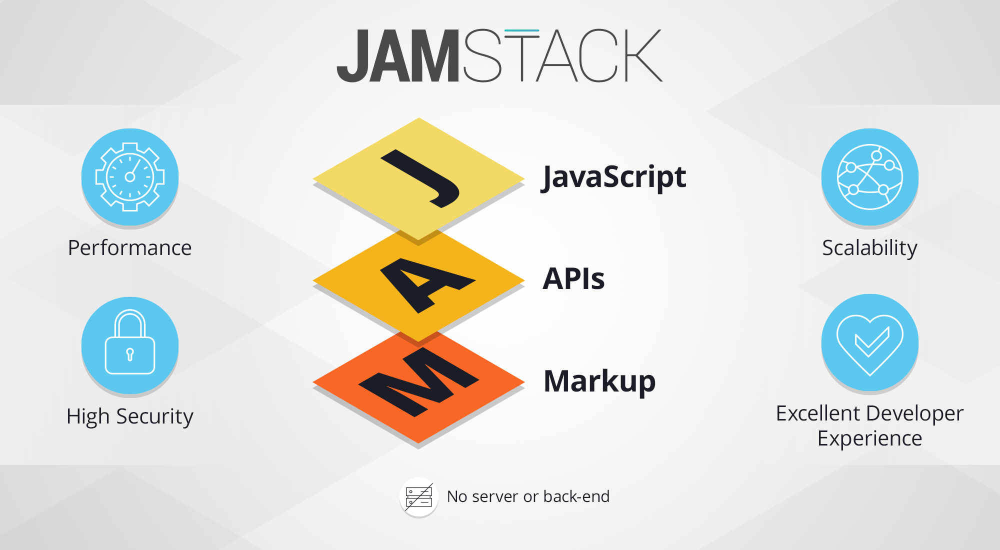

<!-- Hero -->

<columns mode="slim">

Posted on March - 4th - 2021

## What is the JAMStack?

Jamstack is an architecture designed to make the web faster, more secure, and easier to scale. It builds on many of the tools and workflows which developers love, and which bring maximum productivity.

</columns>

<columns mode="slim">

<block>

</block>

<block>

### Why JAMStack?

The Jamstack architecture has many benefits, whether you’re building a large e-commerce site, SaaS application or personal blog.

</block>

</columns>
<columns weight="right" number="2" number-s="2" mode="slim" >
<block class="red-box">

hello
world
in this
test
</block>
<block>

hello
world
in this
test
</block>
<block>

hello
world
in this
test
</block>
<block>

hello
world
in this
test
</block>
</columns>
