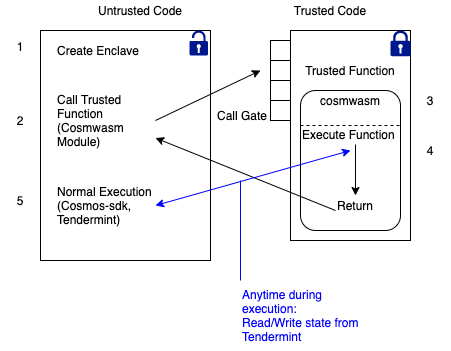

<columns mode="slim">

Update on March 25th 2021

## Network Architecture

The Secret Network facilitates the execution of code (Secret Contracts) with strong correctness and privacy guarantees. In Secret Contracts, data itself is concealed from the nodes that execute computations (also known as "private computation"). This allows developers to include sensitive data in their smart contracts without moving off-chain to centralized (and less secure) systems, thus allowing for truly private and scalable decentralized applications. Secret Network is a proof-of-stake blockchain built on top of the Cosmos SDK, using Tendermint consensus. Governance, staking, bank, and compute modules are currently enabled.

A Secret Contract, written in Rust, is the fundamental innovation of the Secret Network. Secret Contracts are enabled by the compute module, which is unique to the Secret Network. These contracts execute over data which is kept encrypted from nodes, developers, users, and everyone else, while the results of these computations are trusted and verifiable. For application developers, the Secret Contract is the most important feature of the network.

</columns>
